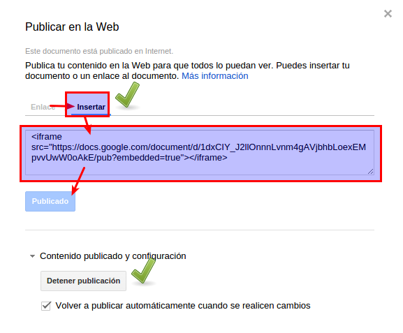

# Cómo conseguir el código embed de Presentaciones de Google

## ¿Cómo se consigue el código embed?

Pues mira estas dos capturas

Y ahora a por el código

Una vez lo tengas, pégalo en el documento de Google que tenemos compartido tal y como ves en la siguiente imagen.

