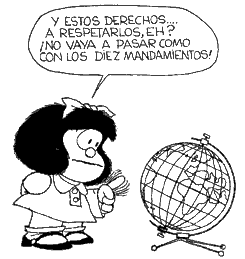

# Derechos y deberes

## Derechos

* Si tu labor va a tener retribución**, está fijada por [resolución](papeles_y_legislacin.md) en 25€ por hora del curso.

    * Es decir, para un curso de 50€ son 1 250€; descontando IRPF, 978,50€.

* Si tu labor no va a tener retribución o según nuestra valoración tiene una retribución menor a la merecida, te damos una publicación con ISBN.

* En los dos casos cedes la propiedad a la DGA y los derechos de los contenidos serán [Creative Commons NC-BY-SA](https://creativecommons.org/licenses/by-nc-sa/3.0/es/) (o sea, tú siempre eres el autor/a y se te reconoce y cita en la obra, pero ya no tienes su propiedad y otra persona no puede aprovecharse económicamente de ella, y esto afecta también a las posibles obras derivadas)

* **POR FAVOR LEE MUY BIEN EL APARTADO [5.4.- DERECHOS DE AUTORÍA](/derechos_de_autor.md)**

* Cuando acabes tu trabajo y tenga nuestro visto bueno, tienes que entregar estos [papeles](papeles_y_legislacin.md)

###Tutorización

* También te proponemos la primera tutorización  (y las siguientes hasta que haya una convocatoria abierta para tutorizar el curso) para que puedas mejorar tu curso.

    * excepto en el caso de los minicursos que no se tutorizan.

* La retribución de la tutorización está fijada por [resolución](papeles_y_legislacin.md) a 0.7€/hora y alumno/a

    * es decir para un curso de 50 horas y 40 alumnos: 1.400€
    * La tutorización de curso on-line se certifica con número GIFP. ([Ver certificados como tutor/a](https://catedu.gitbooks.io/curso-de-tutores/content/8_certificados.html))

## Deberes

Quien se encarga de crear el curso tiene que entregar.

1. **Contenido** del curso en un documento de Google, claramente divido en módulos utilizando los estilos de texto.
    
    * Mira en [está chupao!!!](est_chupao.html)

    * Para resolver cualquier duda técnica, ponte en c[ontacto con CATEDU - Aularagón - Contenidos](http://soporte.catedu.es/).

2. **Evaluación en cada tema**:

    * Cursos tutorizados:

        1. **Obligatorio**: hacer una evaluación tipo **entrega**, es decir, que el alumnado tenga que entregar un fichero, enlace... a quien tutoriza el curso.
        2. **Opcional**:  preguntas **tipo test** si se quiere.

    * Cursos no tutorizados (minicursos). Hay que diseñar preguntas para el cuestionario de moodle o tareas que puedan evaluarse entre el propio alumnado mediante un foro.
    * ¿En qué formato hay que entregar las evaluaciones? Tenemos dos opciones: en el propio documento de Google compartido o la otra opción que te recomendamos: Te damos acceso al Moodle para ponerlas directamente y así queda tal como lo deseas.
        * Para las evaluaciones tipo **entregas**:
            1. Unas instrucciones lo más precisas posibles de qué tiene que entregar el alumnado. **Cuanto más precisas son, más fácil es la tutorización.**
            2. Puede ser una entrega tipo texto (una respuesta o un enlace...) o una entrega tipo fichero (un Word, por ejemlo).
            3. Una breve rúbrica o pautas mínimas exigibles de la entrega que sirvan de guía a quien tutoriza el curso para calificarlo como APTO (no hace falta esta rúbrica si en el enunciado está claro el mínimo exigible).
            4. Por favor, **evita** preguntas con respuestas que tengan una valoración subjetiva, ya que dificulta la tutorización y la evaluación.
        * Para las preguntas tipo **test** sí que recomendamos que lo hagas en Moodle.
            1. La puntuación de cada pregunta.
            2. El enunciado de las preguntas.
                * Se pueden incluir imágenes, enlaces, código embebido...
            3. Las diferentes opciones marcando la verdadera o verdaderas.
                * Se puede fijar % de peso (si es tal opción es el 100% de la puntuación pero si marca **tal opción** es el 50% de la puntuación).

## ¿Cuantos módulos o temas debe tener mi curso?

Normalmente establecemos que debe haber un tema-módulo por cada 10 horas de duración del curso para los cursos tutorizados y, para los minicursos, 2-3 temas breves.

* Los cursos tutorizados tienen una duración de **30 - 40 - 50** horas (no aceptamos más de 50)

    * Hay que tener en cuenta cuánto cuesta realizar la actividad.

* Los minicursos tienen una duración entre **10 - 20** horas.

## Dónde se entrega el material y en qué plazos

* En Aularagón hay tres convocatorias: Junio, Octubre y Febrero, depende de en qué convocatoria va a salir tu curso.
* Te pedimos que, durante el mes anterior al de la convocatoria, ya hayas entregado el material provisional para realizar las revisiones y así tener la versión definitiva durante la convocatoria. 
* Dónde: por [contacto](http://soporte.catedu.es/) al principio y mediante debate en el documento de google posteriormente.

**¿Se puede ver un ejemplo de curso?**

¡Claro! entra en la plataforma de Moodle: [http://moodle.catedu.es/](http://moodle.catedu.es/) en cualquier curso, como persona invitada.

