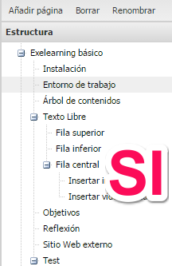

# Forma

## Estilo

<ul>
- Claro y simple1 ****
- Buscar **títulos** atractivos y **cortos** para las unidades y los apartados.
- Al **principio** de cada apartado, usar el estilo **dialogado**. No entrar directamente en materia y acompañar siempre de una imagen.
<li>Evitar los **párrafos extensos**.
<ul>
- Describe brevemente los **objetivos**
- En el **cuerpo** inserta imágenes, vídeos ...
- Destaca los **conceptos claves**
- Es útil finalizar con **una reflexión **o conclusión. 

<strong></strong>

**Embeber **de otros servicios

<ul>
- Si embebes algún contenido creado en otra plataforma** exclusivo para este curso**, tienes que proporcionar el usuario y la contraseña para posibles modificaciones futuras
- Si es de otro usuario o de otros contenidos, por ejemplo un vídeo de Youtube de un tercero, sin problemas puedes hacerlo.
- Si quieres te podemos proporcionar un usuario de Google por si necesitas de sus servicios.

Los **hipervínculos**, no deben de distraer la atención del participante.

- Poner el hipervínculo si es una página muy extensa.
- En el enlace poner un nombre que haga referencia al elemento enlazado.
<li>No poner el hipervínculo sin ninguna instrucción de qué tiene que hacer el alumno con él.
<ul style="list-style-type: circle;">
- Si es un contenido NO OBLIGATORIO, entonces indicarlo: "Para saber más..""Material de apoyo..." (tener en cuenta que la mayoría del alumnado NO lo leerá)
- Si es un contenido OBLIGATORIO: Indicar qué es lo que tienen que leer: "Fíjate en los siguientes aspectos de este enlace...""Lee detenidamente x de este enlace..."

## 

## Árboles jerárquicos

Tal como nombramos, hay que evitar nombres de páginas extensos, pues ensancha el menú lateral de la izquierda.

- Sólo poner el nombre de la página con un **título** atractivos y **corto**
- **Evitar numeraciones y nombres como Unidad, Sección o sus abreviaturas**, dificulta la edición y es innecesario.
- El primer orden de jerarquía hay que poner el título del nombre del módulo, sólo puede haber una página en ese orden de jerarquía. De ahí cuelgan todas las demás páginas. 

